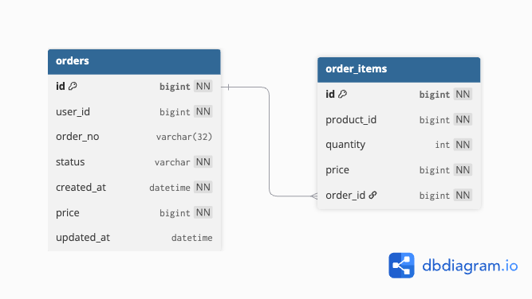

# 🐶 order-service

주문(order) 정보를 관리하는 마이크로서비스입니다.  
주문 생성 ~~조회, 목록 조회, 상태 변경~~ 기능을 제공합니다.

---

## 📌 주요 기능


- 주문 생성 (POST)

_미완성 기능_
- 주문 단건 조회 (GET)
- 유저별 주문 목록 조회 (GET)
- 주문 상태 변경 (PATCH)


---

## 🛠 기술 스택


- Kotlin + Spring Boot 3.5
- JPA (Hibernate)
- webClient
- MySQL 8.x
- Docker / Docker Compose
- JUnit5, MockMvc 테스트
- ControllerAdvice 기반 예외 처리
- `.env` 기반 환경변수 분리

---

## 🗺 ERD



---

## 📂 API 요약

### 주문 생성

`POST /api/orders`

#### 요청 
```bash
curl -X POST http://localhost:8082/api/orders \
-H "Content-Type: application/json" \
-d '{
 "userId": 1,
  "items": [
    {"productId":1, "price":30000, "quantity":2},
    {"productId":2, "price":15000, "quantity":1}
  ]
}'
```

#### 응답
```json
{
  "orderId": 1001
}
```

---

## ❌ 예외 응답 예시

### 재고 부족
```bash
curl -X POST http://localhost:8082/api/orders \
-H "Content-Type: application/json" \
-d '{
 "userId": 1,
  "items": [
    {"productId":1, "price":30000, "quantity":99999},
    {"productId":2, "price":15000, "quantity":1}
  ]
}'
```
#### 응답
```json
{ "message": "재고 부족: 1" }
```
