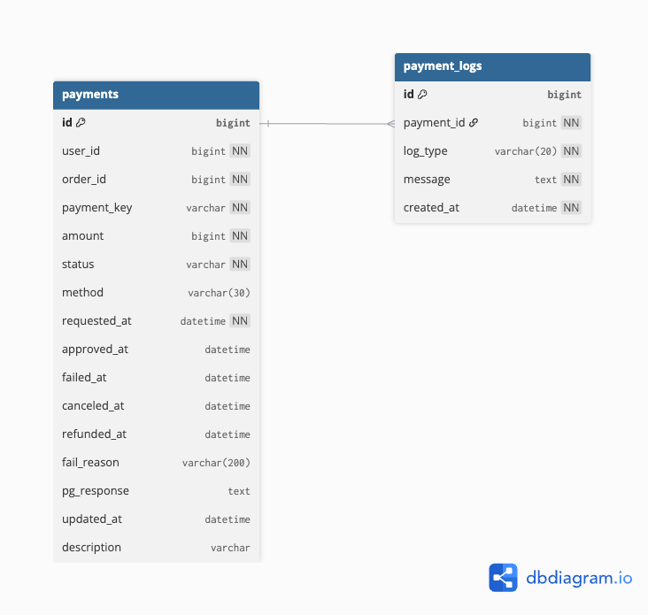

# 💳 payment-service

PG 결제 요청 및 승인, 실패 응답과 상태 이력 관리를 담당하는 결제 마이크로서비스입니다.  
WebClient 기반 동기 통신으로 주문 서비스와 통합되며, 추후 Kafka 기반 비동기 구조로 확장 예정입니다.

---

## 📌 주요 기능

- 결제 요청 생성 (POST)
- 결제 상태 전이 관리 (`PENDING | SUCCESS | FAIL | CANCELED | REFUNDED`)

---

## 🛠 기술 스택

- Kotlin + Spring Boot 3.5
- JPA (Hibernate)
- MySQL 8.x
- Docker / Docker Compose
- JUnit5, MockMvc 테스트
- ControllerAdvice 기반 예외 처리
- `.env` 기반 환경변수 분리

---
## 🗺 ERD




## 📂 API 요약

### 결제 요청
- `POST /api/payments`
#### 요청
```bash
curl -X POST http://localhost:8083/api/payments \
-H "Content-Type: application/json" \
-d '{
  "userId": 1
  "orderId": 1,
  "amount": 50000,
  "method": "카드"
}'
```

#### 응답
```json
{
  "paymentId": "1",
  "paymentKey": "success_fed5aa96-8a95-4647-b351-699095d1485e",
  "failReason": null
}
```

#### ❌ 예외 응답 - 한도초과
```json
{
  "paymentId": "1",
  "paymentKey": "fail_6e4d8b1a-b070-404d-b088-f4859ffae401",
  "failReason": "한도초과"
}
```
