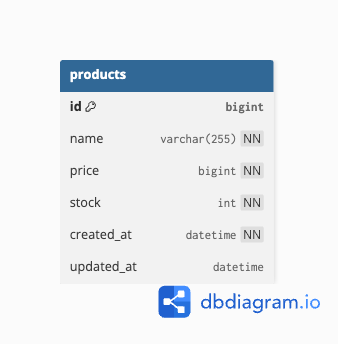

# 🐾 product-service

상품 정보를 관리하는 마이크로서비스입니다.  
상품 등록, 조회, 재고관리 기능을 제공합니다.  
---

## 📌 주요 기능

- 상품 등록 (POST)
- 상품 단건 조회 (GET)
- 상품 목록 조회 (GET)

---

## 🛠 기술 스택

- Kotlin + Spring Boot 3.5
- JPA (Hibernate)
- MySQL 8.x
- Docker / Docker Compose
- JUnit5, MockMvc 테스트
- ControllerAdvice 기반 예외 처리
- `.env` 기반 환경변수 분리

---

## 🗺 ERD




---

## 📂 API 요약

### 상품 등록
`POST /api/products`

#### 요청
```bash
curl -X POST http://localhost:8081/api/products \
-H "Content-Type: application/json" \
-d '{
  "name": "로얄캐닌 고양이 사료",
  "price": 35000,
  "stock": 1000
}'
```

#### 응답
```json
{
  "productId": 1
}
```

---

### 상품 단건 조회
`GET /api/products/{productId}`

#### 요청
```bash
curl http://localhost:8081/api/products/1
```

#### 응답
```json
{
  "name": "로얄캐닌 강아지 사료",
  "price": 35000,
  "stock": 1000
}
```

---

### 전체 상품 목록 조회
`GET /api/products`

#### 요청
```bash
curl http://localhost:8081/api/products
```

#### 응답
```json
[
  {
    "name": "로얄캐닌 강아지 사료",
    "price": 35000,
    "stock": 1000
  },
  {
    "name": "로얄캐닌 고양이 사료 키튼",
    "price": 38000,
    "stock": 500
  }
]
```

---

## ❌ 예외 응답 예시

### 존재하지 않는 상품 조회
```bash
curl http://localhost:8081/api/products/9999
```

#### 응답
```json
{
  "message": "상품을 찾을 수 없습니다. [id = 9999]"
}
```
