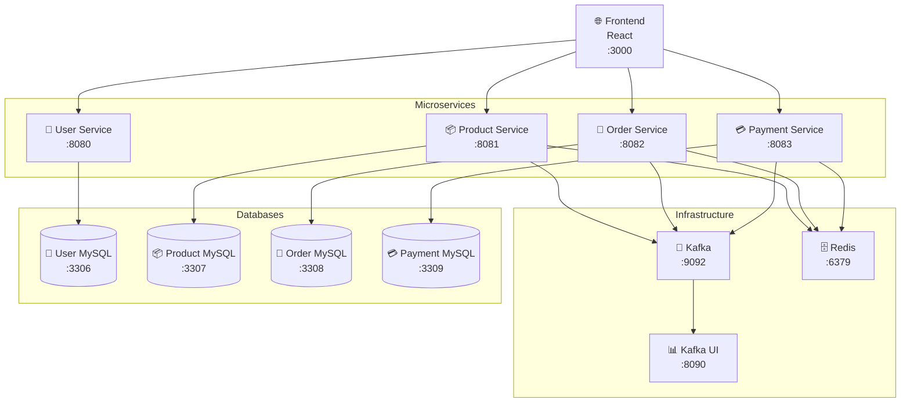
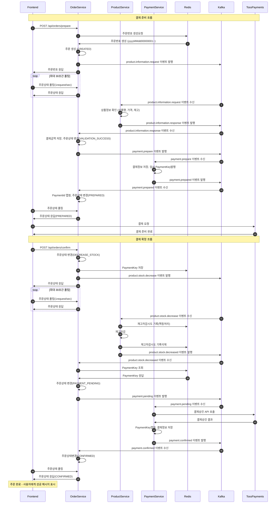
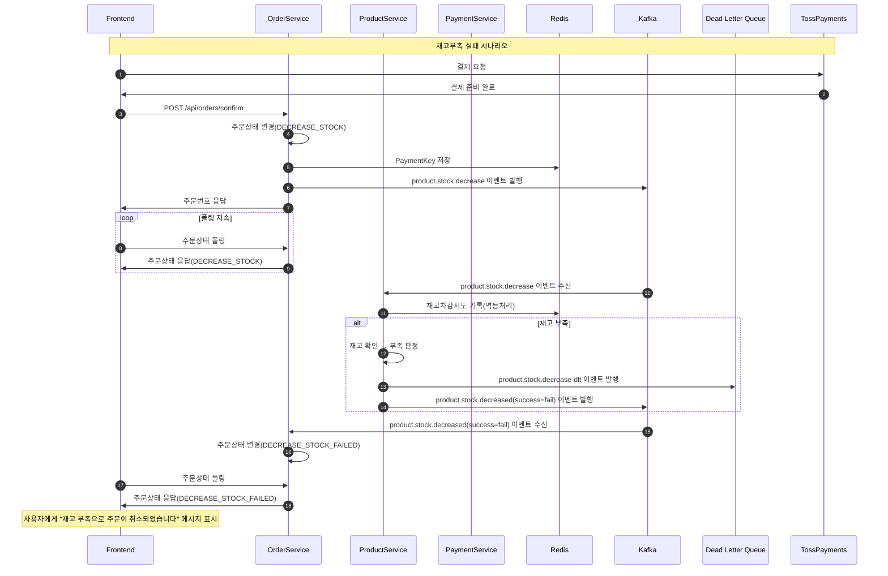
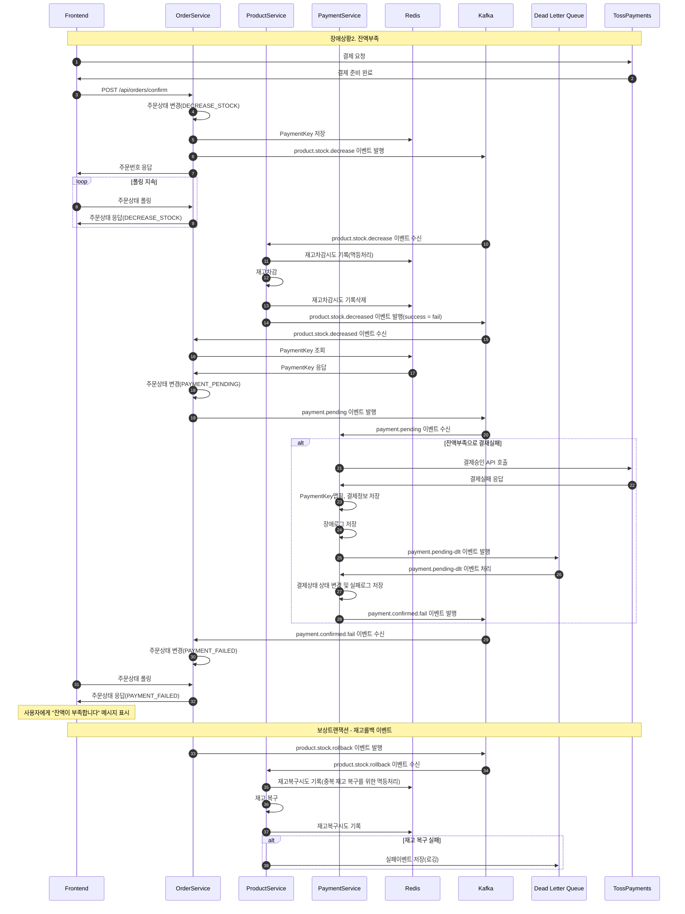

# 🐾 I Love Pet

I Love Pet은 펫샵 전자상거래 플랫폼을 위한 MSA(Microservice Architecture) 기반 시스템입니다.  
사용자 관리, 상품 카탈로그, 주문, 결제 등 각 도메인을 독립된 서비스로 구성하였으며,  
서비스 간 통신은 Kafka를 활용한 비동기 이벤트 기반 메시징 방식으로 처리됩니다.


## 📅 개발 기간

**2025. 07 ~ 2025. 09 (약 2개월, 1차 MVP)**

### 주요 개발 마일스톤
- **Phase 1** (2025. 08): 프로젝트 초기모델 개발
- **Phase 2** (2025. 09): 서비스간 통신을 WebClient를 이용한 동기방식에서 Kafka를 이용한 이벤트 기반 구조로 변경


## 🏗 시스템 아키텍처

프로젝트는 4개의 마이크로서비스와 React 기반 프론트엔드로 구성됩니다.



## 🛠 기술 스택

### 백엔드 서비스
- **Language**: Kotlin
- **Framework**: Spring Boot 3.5
- **Database**: MySQL 8.x (각 서비스별 독립 DB)
- **ORM**: JPA (Hibernate) & QueryDsl
- **Message Queue**: Apache Kafka
- **Cache**: Redis
- **Container**: Docker & Docker Compose

### 프론트엔드
- **Framework**: React 19.1.1
- **Router**: React Router DOM 7.8.0
- **Payment**: TossPayments SDK
- **Testing**: Testing Library

### 인프라
- **Container Orchestration**: Docker Compose
- **Service Discovery**: 내장 네트워크
- **Message Broker**: Kafka + Zookeeper
- **Cache**: Redis
- **Monitoring**: Kafka UI

## 📋 서비스 목록

| 서비스 | 포트 | 설명 | 주요 기능 |
|--------|------|------|-----------|
| **User Service** | 8080 | 회원 관리 | 회원가입, 조회, 존재확인 |
| **Product Service** | 8081 | 상품 관리 | 상품 등록/조회, 재고관리 |
| **Order Service** | 8082 | 주문 관리 | 주문 생성, 상태 관리 |
| **Payment Service** | 8083 | 결제 관리 | 결제 요청/승인, 상태 추적 |
| **Frontend** | 3000 | 사용자 인터페이스 | React 기반 웹 애플리케이션 |


## 📂 프로젝트 구조

```
i-love-pet/
├── user-service/          # 회원 관리 서비스
├── product-service/       # 상품 관리 서비스
├── order-service/         # 주문 관리 서비스
├── payment-service/       # 결제 관리 서비스
├── front/                 # React 프론트엔드
├── docker-compose.yml     # 전체 시스템 실행
└── .env                   # 환경 변수 설정
```


## 📊 주요 기술적 특징

- **Event-Driven Architecture**: Kafka 기반 비동기 메시징
- **SAGA Pattern**: 분산 트랜잭션 관리 및 보상 트랜잭션
- **Idempotency**: Redis를 활용한 멱등성 보장
- **Dead Letter Queue**: 실패 이벤트 처리 및 재시도
- **Database Per Service**: 서비스별 독립 데이터베이스


## 🚀 빠른 시작

### 사전 요구사항
- Docker & Docker Compose
- Node.js (프론트엔드 개발 시)
- JDK 17+ (백엔드 개발 시)

### 1. 환경 변수 설정
프로젝트 루트에 `.env` 파일을 생성하고 다음 내용을 설정:

```env
추후 공개에정
```

### 2. 전체 시스템 실행
```bash
# 모든 서비스 빌드 및 실행
docker-compose up -d --build

# 로그 확인
docker-compose logs -f [service-name]

# 상태 확인
docker-compose ps
```

### 3. 서비스 접속 확인
- User Service: http://localhost:8080/api/users
- Product Service: http://localhost:8081/api/products
- Order Service: http://localhost:8082/api/orders
- Payment Service: http://localhost:8083/api/payments
- Kafka UI: http://localhost:8090
- Frontend: http://localhost:3000 (별도 실행 필요)

## 🔧 개발 환경 설정

### 프론트엔드 개발
```bash
cd front
npm install
npm start
```

### 개별 서비스 개발
```bash
# 각 서비스 디렉토리에서
./gradlew bootRun
```

## 📊 데이터베이스 스키마

각 서비스는 독립적인 MySQL 데이터베이스를 사용합니다:
- **user-mysql**: Port 3306
- **product-mysql**: Port 3307
- **order-mysql**: Port 3308
- **payment-mysql**: Port 3309

### 🗂 ERD (Entity Relationship Diagram)

마이크로서비스 아키텍처에서 각 서비스는 독립된 데이터베이스를 가지며, 서비스 간 논리적 관계는 점선으로 표현됩니다.



#### 📝 ERD 범례
- **실선 (—)**: 물리적 외래키 관계 (동일 데이터베이스 내)
- **점선 (...)**: 논리적 관계 (서로 다른 마이크로서비스 간)

#### 🔗 서비스 간 논리적 관계
1. **User ↔ Order**: `User.id` ↔ `Order.user_id`
2. **Order ↔ Payment**: `Order.id` ↔ `Payment.order_id`, `Order.payment_id` ↔ `Payment.id`
3. **Product ↔ OrderItem**: `Product.id` ↔ `OrderItem.product_id`
4. **Order ↔ OrderItem**: `Order.id` ↔ `OrderItem.order_id` (현재 미구현)

## 🔄 Kafka 토픽 구조

서비스 간 이벤트 통신에 사용되는 주요 Kafka 토픽:

### 주문 처리 플로우
```
product.information.request   # 상품 정보 조회 요청
product.information.response  # 상품 정보 응답
payment.prepare              # 결제 준비 요청
payment.prepared             # 결제 준비 완료
product.stock.decrease       # 재고 차감 요청
product.stock.decreased      # 재고 차감 완료/실패
payment.pending              # 결제 진행 요청
payment.confirmed            # 결제 완료
product.stock.rollback       # 재고 롤백 (보상 트랜잭션)
```

### 접속 정보
- **Kafka Broker**: localhost:9092
- **Zookeeper**: localhost:2181
- **Kafka UI**: localhost:8090 (토픽/메시지 모니터링)

## 📋 주문 처리 플로우

### 1. 정상 주문 처리


---

### 2. 주문 실패 처리
#### 2-1. 재고부족



#### 2-2. 잔액부족




## 🔧 개발 및 테스트

### 로컬 개발 환경
```bash
# 개별 서비스 실행
cd [service-directory]
./gradlew bootRun

# 프론트엔드 개발 서버
cd front
npm install && npm start
```

### 주요 API 엔드포인트
```
POST   /api/orders/prepare     # 주문 준비
POST   /api/orders/confirm     # 주문 확정
GET    /api/orders/{orderId}   # 주문 상태 조회
GET    /api/products           # 상품 목록
POST   /api/users/register     # 회원가입
```

### 테스트 실행
```bash
# 전체 서비스 테스트
./gradlew test

# 특정 서비스 테스트
cd order-service && ./gradlew test

# 프론트엔드 테스트
cd front && npm test
```

## 🔍 모니터링 도구

- **Kafka UI**: http://localhost:8090 (토픽, 메시지 모니터링)
- **Docker Stats**: `docker-compose logs -f [service-name]`
- **Service Health**: 각 서비스 `/health` 엔드포인트
