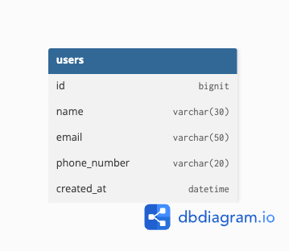

# 🐶 user-service

회원 정보를 관리하는 마이크로서비스입니다.  
회원 등록, 조회, 존재 유무 확인 기능을 제공합니다.

---

## 📌 주요 기능

- 회원가입 (POST)
- 회원 단건 조회 (GET)
- 회원 존재 여부 확인 (GET)

---

## 🛠 기술 스택

- Kotlin + Spring Boot 3.5
- JPA (Hibernate)
- MySQL 8.x
- Docker / Docker Compose
- JUnit5, MockMvc 테스트
- ControllerAdvice 기반 예외 처리
- `.env` 기반 환경변수 분리

---
## 🗺 ERD




## 📂 API 요약

### 회원가입
`POST /api/users`
#### 요청
```bash
curl -X POST http://localhost:8080/api/users \
-H "Content-Type: application/json" \
-d '{
"name": "박하나",
"email": "hana@lovepet.com",
"phoneNumber": "01012345678"
}'
```
#### 응답
```json
{
  "userId":1,
  "name":"박하나",
  "email":"hana@lovepet.com",
  "phoneNumber":"01012345678"
}  
```

### 회원 조회
`GET /api/users/{userId}`
#### 요청
```bash
curl http://localhost:8080/api/users/1
```
#### 응답
```json
{
  "userId":1,
  "name":"박하나",
  "email":"hana@lovepet.com",
  "phoneNumber":"01012345678"
}

```
### 회원 존재 확인
`GET /api/users/{userId}/exist`
#### 요청
```bash
curl http://localhost:8080/api/users/1/exist
```

#### 응답
```json
{
  "exist": true
}
```
---

## ❌ 예외 응답 예시
### 존재하지 않는 회원 조회
```bash
curl http://localhost:8080/api/users/9999
```
```json
{
  "message": "User not found [id = 9999]"
}
```
